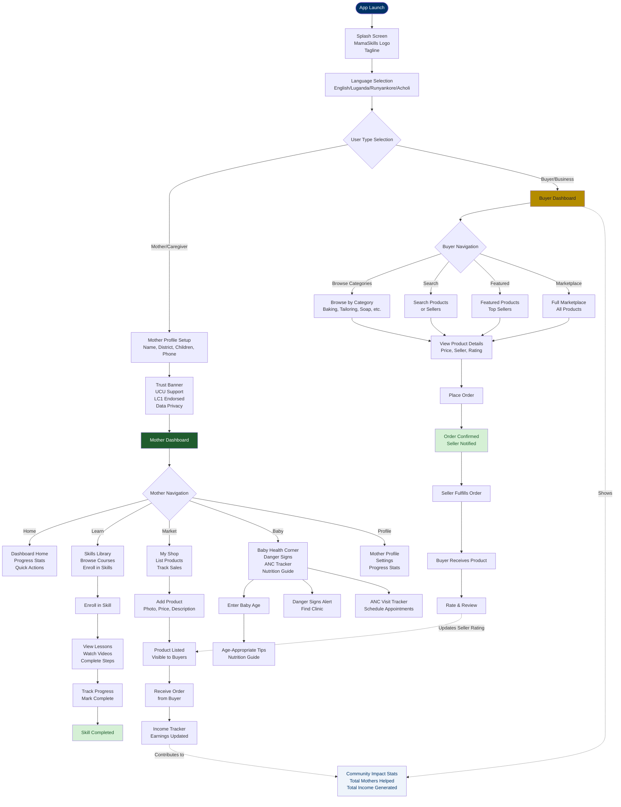
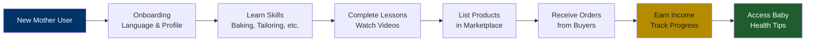
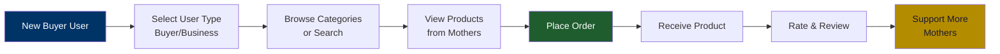
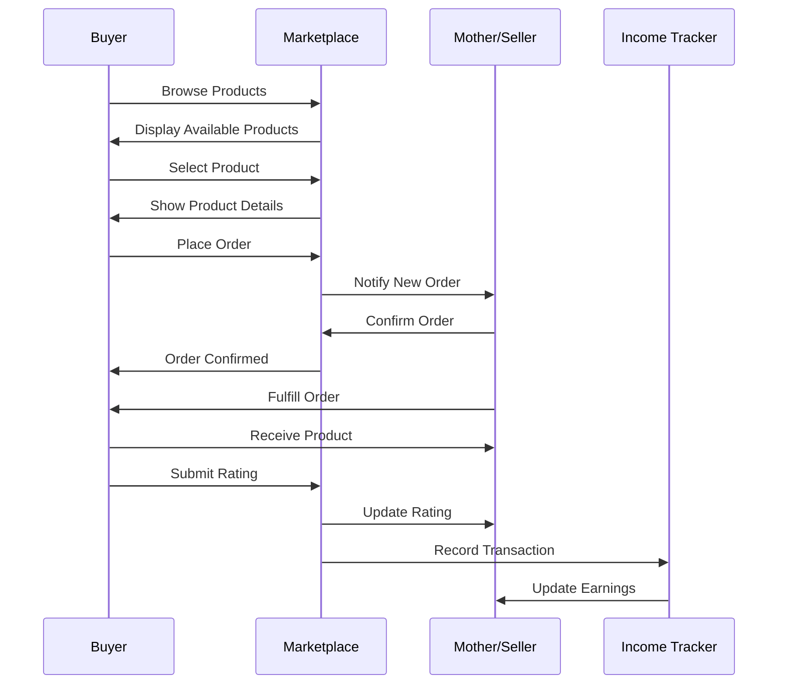
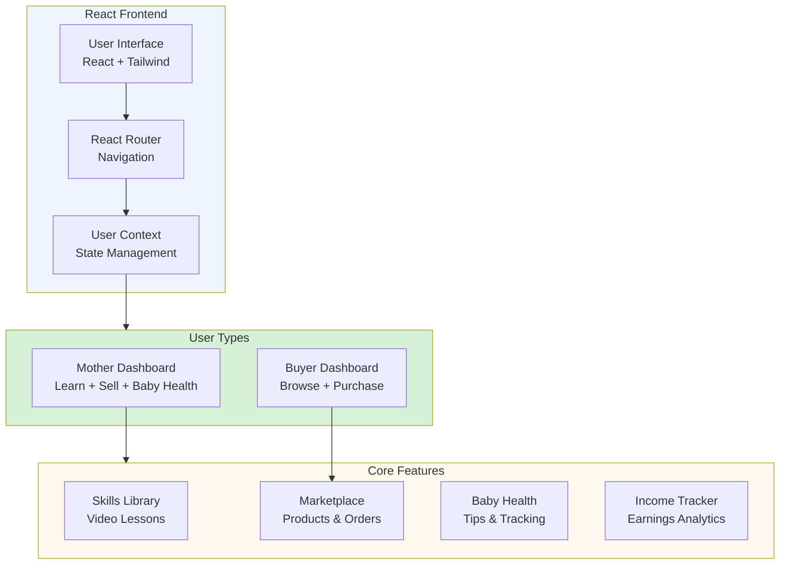
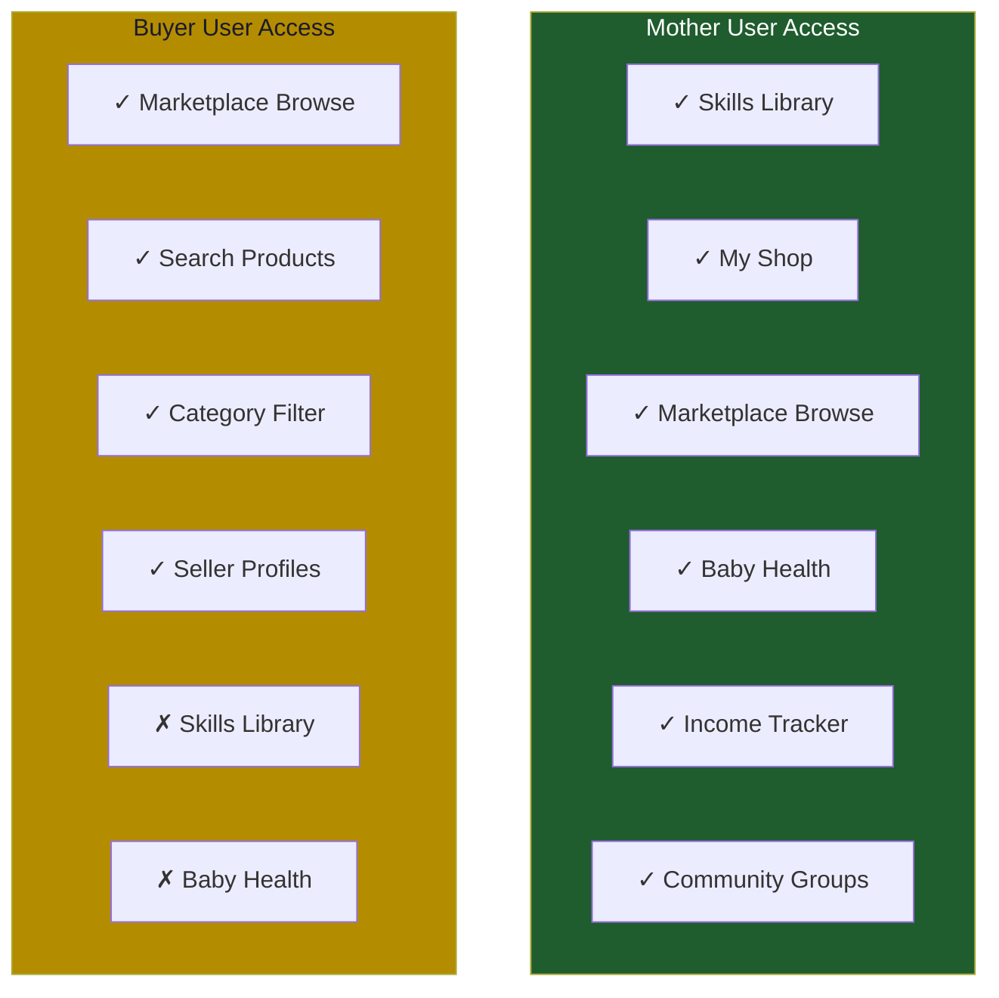
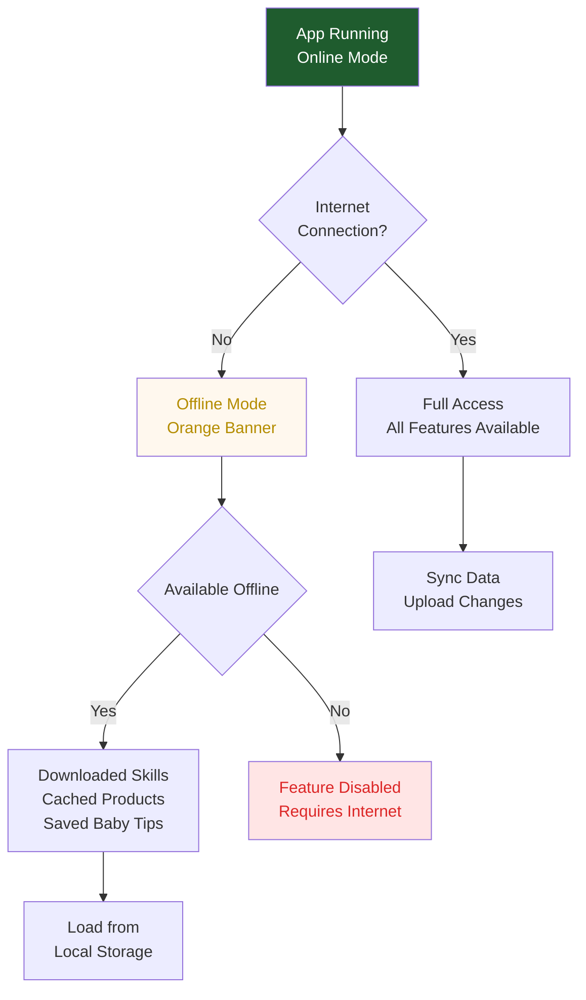

# MamaSkills System Flow

## Complete System Flowchart

## User Journey: Mother

## User Journey: Buyer

## Data Flow: Marketplace Transaction

## System Architecture

## Feature Access Matrix

## Offline Mode Flow

